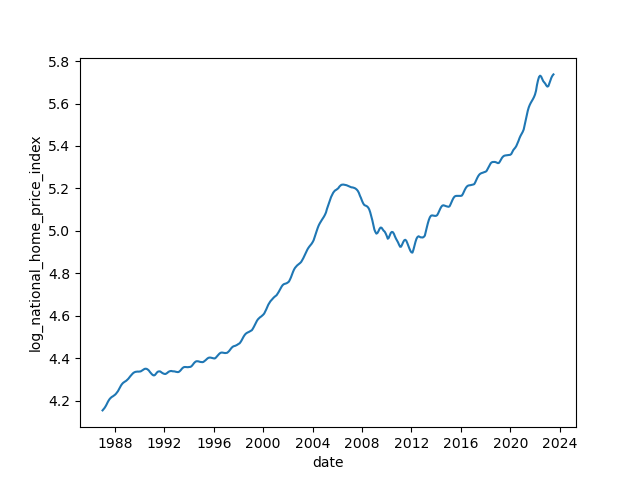
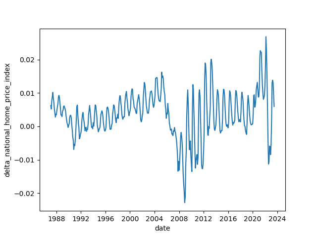

## Report for Predicting the National Home Price Index

Shihan Zhou, 2023/10/06

### Summarize the findings:

* S&P/Case-Shiller U.S. National Home Price Index shows an exponential growing trend and seasonality with one year as a period.
* Time series **SARIMA** can well predict the log home price index by explaining about 75% of the log returns in 1-month look-ahead prediction. If predicting 6-month ahead, the SARIMA model still has an advantage over simple linear trend, explaining about 30% of the variance.  
* Generally, single macroeconomic indicator does not have strong correlation with the log difference of national home price index. But they can be well summarized by 3 principal components (seen as macro  fundamentals) , the principal components can improve the predicting ability when using **regression** model.

* Machine learning model does not work well in solving time series problem with a small sample set.
* Introducing exogenous variables in SARIMA model, **SARIMAX** does not work better than SARIMA model.

### 1. Data Collection

* I choose indicators to reflect different aspects of the macro economy from FRED, including **economic growth, inflation, interest rate,  employment and house market condition**.

* The variables are  listed below:

* Monthly:

  - 10-Year Real Interest Rate（REAINTRATREARAT10Y)
  - Capacity Utilization: Total Index (TCU)
  - Sticky Price Consumer Price Index (STICKCPIM157SFRBATL)
  - Consumer Price Index for All Urban Consumers: All Items in U.S. City Average (CPIAUCSL)
  - Personal Consumption Expenditures (PCE)
  - Federal Funds Effective Rate (FEDFUNDS)
  - Unemployment Rate (UNRATE)
  - Employment Level - Nonagricultural Industries (LNS12035019) / Employment Level (CE16OV)
  - New Privately-Owned Housing Units Under Construction: Total Units (UNDCONTSA)
  - New Privately-Owned Housing Units Completed: Total Units (COMPUTSA)
  - Personal Saving Rate (PSAVERT)
  - New Privately-Owned Housing Units Started: Total Units (HOUST)
  - Median Sales Price for New Houses Sold in the United States (MSPNHSUS)
  - 30-Year Fixed Rate Mortgage Average in the United States (MORTGAGE30US)

  Quarterly:

  - GDP

* All the monthly variables are released before the home price index is released and therefore can be obtained timely. (We can even use the month_t indicators to predict the month_t  national home price index because it is released later.) 

* GDP is released late, so when aligning the data, I delay the GDP by 1-quarter.

#### 2. Descriptive Statistics Analysis

* Log national home price index

  

* Log difference of home price index --> showing significant pattern of seasonality

  

* **If Stationary?**

  * Log national home price index is not stationary, but its one order difference is stationary.

  * From the Autocorrelation figures (ACF), most of the macro indicators are not stationary. (This may result in false correlation problem if we apply regression model to 2 non-stationary time series.)

    

  * I calculate one-order difference to make those non-stationary variables stationary. 

* **Correlation:**

  

  * Plot the lagged correlation with log difference of national home price index (Select some variables with comparatively high correlation in the corr matrix)

    

* I also did some cointegration test to test those indicators who has high correlation with the log national home price index and see whether is false correlation.
  * we see only GDP, PCE and units of house started are correlated.

#### 3. PCA: find economical fundamental factors

* I try to summarize these macro indicators by PCA

* 3 principal components is enough to explain most of the variance 

  

  * Loading of the PCA shows some meanings of each one:
    * PCA1: focus on interest rate and growth
    * PCA2: focus on unemployment, negative side of the economy
    * PCA3: inflation

* The PCs are not stationary but their 1-order difference is stationary.

* 

* 

#### 4. SARIMA MODELS 

* I choose SARIMA model to fit the national home price index because the index is a typical time series and has strong seasonality and growing trend. The historical trend of the index itself is informative.

* I leave 2018 Aug -2023 Aug as testing set and the remaining is training set.

* Firstly, I identify the model order use ACF and PCA, as well as AIC/ BIC rules, Then, I fit the model. The residuals is no longer self-correlated but shows heteroscedasticity. (We may fit GARCH model if we want to be more accurate.)

* If I stand at 2018 to predict the following 5 years, the predicted value is quite accurate at the first 2 years. But the booming of house price at 2020 can not be foreseen.

  

* Then on a rolling basis, I refit the model every month to predict the next month's log house price index. The 1-month look ahead is quite close to the real value. 

  

* If look 6-month ahead, it is more volatile:

  

  

### 5. Linear Regression and  Machine Learning 

* Use Machine Learning or regression should treat the values as uncorrelated and calculate more variables to represent the historical information about the time series. But since the number of samples is limited, machine learning has a significant problem of **overfitting** and do not compensate for the loss of time series information.

* In the regression model, let $Y_t$ be the log difference of home price index, we want to use predicting indicators $X_{t-1},X_{t-2},..$, to predict them. I also add the past 2 months' log difference of $Y_{t-1}, Y_{t-2}, Y_{t-12}$  as predicting variables. 

* I find that using PCA as predictors in regression model works better than selected variables. 

  

#### 6. SARIMAX model

*  I try to select some exogenous variables to improve the performance of SARIMA model by using SARIMAX model. The selected variables are those who shows correlation with the log-diff national home price index and is stationary and also logically, theoretically influence the home price.

* But after parameter estimation, we can see the exogenous variables has little predicting power given the historical information of the home price index times series itself.

* The 6-month look-ahead prediction also does not improve.

  

##### FOR more detail, please find my code ipynb in the code_pj1 folder.
